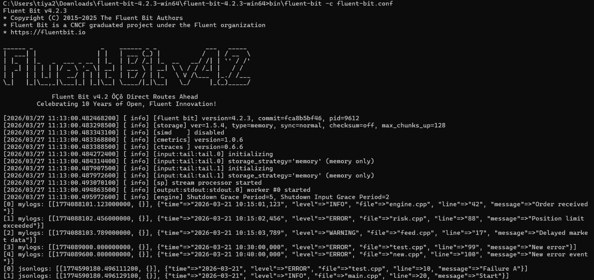
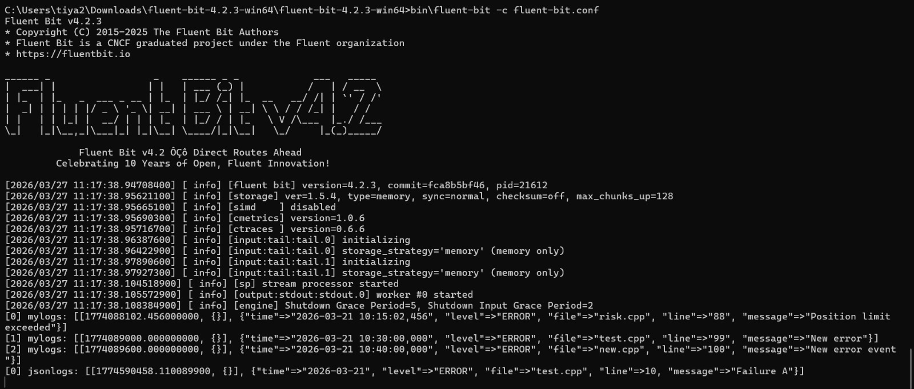
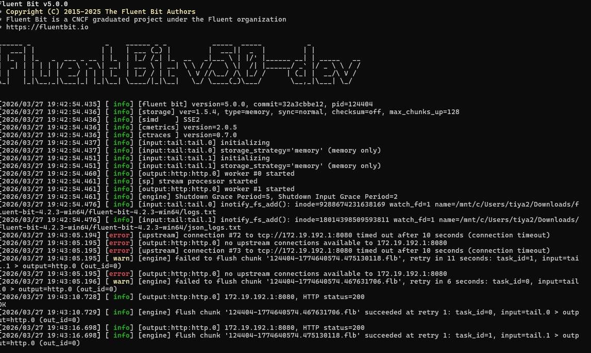
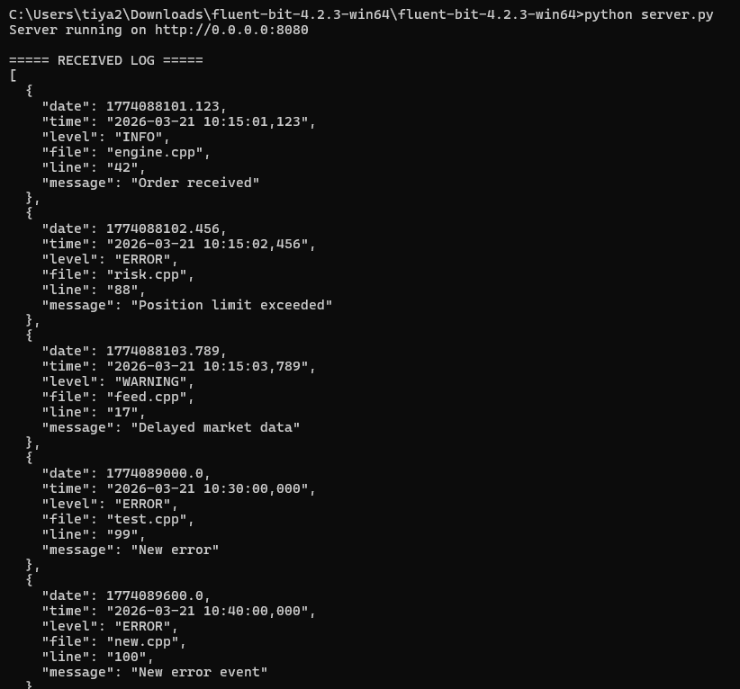
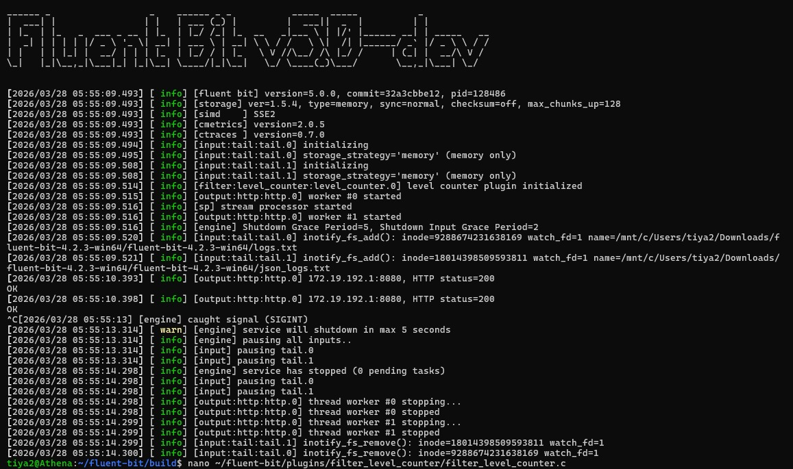
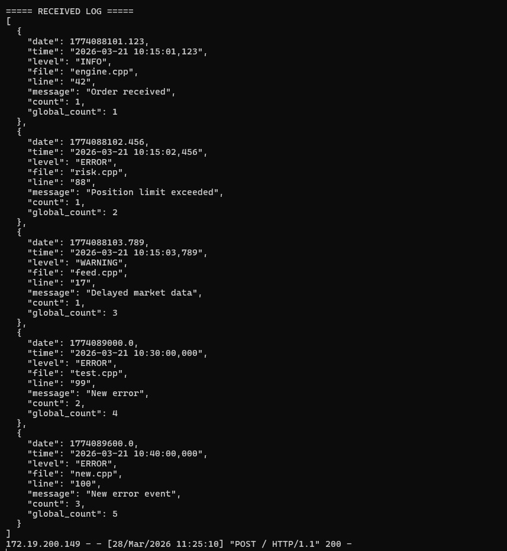

# Fluent Bit Log Processing Pipeline with Custom Filter Plugin

## Overview

This project implements a complete log processing pipeline using Fluent Bit. It demonstrates parsing, filtering, enrichment, and forwarding logs to an HTTP server.

The pipeline:

```
Log File → Parser → Custom Filter Plugin → HTTP Output → Local Server
```

---

## Features

* Parses structured and JSON logs
* Supports multiple log formats
* Custom C filter plugin for log level counting
* Sends enriched logs to a local HTTP server
* Maintains running count per log level

---

## Phases Implemented

* Phase 1: Basic pipeline with parsing and stdout
* Phase 2: Multiple parsers
* Phase 3: Config-level filtering
* Phase 4: Custom filter plugin
* Phase 5: Validation using stdout
* Phase 6: Local HTTP server
* Phase 7: HTTP output integration
* Phase 8: Bonus feature (global/stateful counting)

---

## Setup Instructions

### 1. Build Fluent Bit with Plugin

```bash
cd fluent-bit/build
cmake ..
make
```

---

### 2. Run HTTP Server

```bash
cd server
python server.py
```

Server runs at:

```
http://localhost:8080
```

---

### 3. Run Fluent Bit

```bash
./bin/fluent-bit -c /path/to/conf/fluent-bit.conf
```

---

## Sample Logs

### logs.txt

```
2026-03-21 10:15:01,123 : INFO : [engine.cpp : 42] : Order received
2026-03-21 10:15:02,456 : ERROR : [risk.cpp : 88] : Position limit exceeded
```

### json_logs.txt

```json
{"time":"2026-03-21","level":"ERROR","file":"test.cpp","line":10,"message":"Failure A"}
```

---


## Components

### 1. Parser

Extracts structured fields from raw logs.

### 2. Filter Plugin

Adds a `count` field based on log level frequency.

### 3. Output

Sends logs via HTTP to local server.

---

## How to Verify

* Check server terminal output
* Ensure:

  * `count` field exists
  * counts increment correctly
  * multiple log formats are parsed

---

## Technologies Used

* Fluent Bit (C)
* Custom C Plugin
* Python HTTP Server

---

## Screenshots

### Fluent Bit Running


---

### Stdout Validation 


---

### HTTP Server Receiving Logs


---

### Server


## Global Variable


## Global Variable status in server


